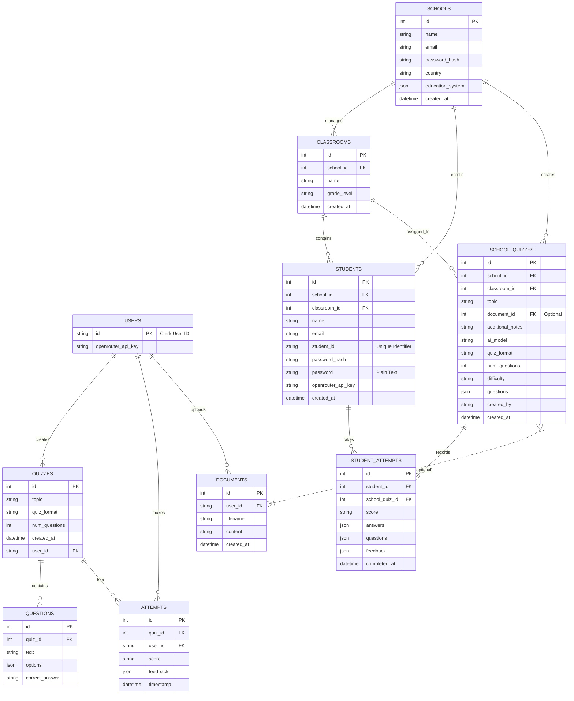

# Database Structure

## Entity Relationship Diagram

## Tables Overview

### User Context
- **Users**: Represents the admin/teacher users (authenticated via Clerk).
- **Quizzes**: Quizzes generated by users.
- **Questions**: Individual questions belonging to a quiz.
- **Attempts**: Records of users taking their own quizzes (or potentially testing them).
- **Documents**: Documents uploaded by users for quiz generation.

### School Context
- **Schools**: Represents the school entity.
- **Classrooms**: Classes within a school.
- **Students**: Students enrolled in a specific classroom.
- **SchoolQuizzes**: Quizzes created by the school/teacher for specific classrooms.
- **StudentAttempts**: Records of students taking the assigned school quizzes.

Note: There seems to be a separation between the "User" context (possibly for a SaaS/individual version) and the "School" context (for the school management system). `SchoolQuizzes` can optionally reference `Documents` which are owned by `Users`.
